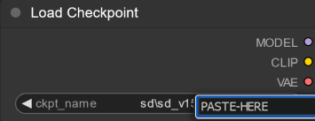

# Extra Network Browser

Inspired by the Extra Network tabs in Automatic1111's WebUI, Extra Network Browser is a stand-alone take on the concept with additional features.

Easily choose a LoRA, HyperNetwork, Embedding, Checkpoint, or Style visually and copy the trigger, keywords, and suggested weight *to the clipboard* for easy pasting into the application of your choice.

Advantages over the Extra Network Tabs:

* Great for UI's like ComfyUI when used with nodes like [Lora Tag Loader](https://github.com/badjeff/comfyui_lora_tag_loader/) or [ComfyUI Prompt Control](https://github.com/asagi4/comfyui-prompt-control).
* Considerably faster, loads thousands of LoRA in a flash.
* A Styles tab that parses a styles CSV for thumbnail previews just like networks.
* Keywords in the filename inside brackets [ ]'s are copied along with the LoRA trigger.
* Weights placed in braces { }'s *(eg {1.0} or {0.7-0.8})* in the filename are automatically set in the LoRA's trigger.
* Some characters not compatible with filenames are automatically converted from placeholders, such as ©️ to : *(see Keywords with Weights below)*

## Installation / Setup

This project is very much primarily a personal project that's being shared. As such, setup is a little raw but also fairly straight-forward.

1) You must have [Node.JS](https://nodejs.org/en) installed. (I recommend the LTS)
2) clone (or download) this repo and cd into the newly created folder.
3) cd api && npm install *(once)*
4) From api folder: node index. *(this starts the backend that'll deal with the filesystem)*

5) In another terminal: cd app && npm install *(once)*
6) From app folder: npm run build *(The React frontend - you only need to build **once** per update)*
7) From app folder: npm run preview *(or serve the dist folder with the webserver of your choice, such as nginx)*

From here on, you can just use `node index` from the api folder to start the backend, and `npm run preview` from the app folder to start the frontend.

In addition, the following **must** be be done once:

1) cd api/networks

2) symlink your WebUI or other existing model folders to the following names: `lora`, `checkpoints`, `hypernets`, `styles`

3) symlink your WebUI styles.csv to the root of the networks folder.

***OR***

1) cd api/networks

2) create the folders: `lora`, `checkpoints`, `embeddings`, `hypernets`, `styles`, and populate with your files.

3) create the file styles.csv with *(only)* `name,prompt` on the first line, following the format listed below.

<details>

<summary>How to make symbolic links</summary>

Symlinking your existing folders is suggested and can be done as such:

``` bash
# Windows
mklink /d lora C:\webui\models\LoRA
# ... (other folders) ...
mklink styles.csv C:\webui\styles.csv

# Linux:
ln -s ~/webui/models/LoRA lora
# ... (other folders) ...
ln -s ~/webui/styles.csv styles.csv
```
</details>

## How to Use / Examples:

Filenames following the suggested naming convention are ***optional***, but to get the full convivence of the Extra Network Browser, the following format is suggested:

``` ini
name_v1_author [keyword1, keyword2] [keyword3, keyword4] (suggested model) {weight1-weight2} #tag1 #tag2.safetensors
```

<br />

**For example, A LoRA named:**

`example-lora_v1_johndoe [mylora] [anotherkeyword] (RevAnimated) {0.7-0.8} #style.safetensors`

will copy to the clipboard:

`mylora, anotherkeyword <lora:my-lora_v1_johndoe [mylora, anotherkeyword] (RevAnimated) {0.7-0.8} #style:0.8>`

with the needed ***keywords and suggested weight ready to go!***

This is based on my personal naming preferences and has worked well for managing a large collection.<br />
If you choose to follow a different naming convention without keywords or weights, the program will still simply copy ```<lora:LoraName:1.0>``` to the clipboard.

---

**Another example, Keywords with Weights:**

`example-lora_v1_johndoe [anotherlora, (awesome:1©️4}] [anotherkeyword] (RevAnimated) {1.0} #style.safetensors`

will copy to the clipboard:

`anotherlora, \(awesome:1.4\), anotherkeyword <lora:nother-lora_v1_johndoe [anotherlora, (awesome:1.4}] [anotherkeyword] (RevAnimated) {1.0} #style:1.0>`

Note the ( )'s properly escaped and ©️ replaced by : (because : can't be in a filename).  I've found this very useful when dealing with keywords that have suggested weights.

Without a weight or range, it will default to :1.0.

---

### Other Networks:

Hypernetworks will copy the keywords, name, and weight using the formats above:

`keywords <hypernet:NAME:WEIGHT>`

while **Checkpoints** and **Embeddings** will copy the name to the clipboard for easy pasting and/or filtering within the UI of your choice.

#### Where to paste checkpoint names in WebUI and ComfyUI:

 &nbsp;


then press enter.

---

### Styles:

Some LoRA have multiple possible characters, outfits, or activations attached.  Managing all of this in the filename is impractical, and sometimes impossible due to filename length limits.

For that reason I recommend storing activations for LoRA with many keywords in your Styles.csv, either the one created by Auto's WebUI or manually created.

Each entry (name, prompt) in the file then becomes a card, just like LoRA, checkpoints, etc. for easy copying of the keywords to the clipboard.

**The suggested format for styles.csv is:**

```
name,prompt
Name (Author) - Description, "keywords"
```

For example:

```
name,prompt
My-LoRA (John Doe) - Style 1, "keyword1, additional keywords, etc"
My-LoRA (John Doe) - Style 2, "keyword2, additional keywords, etc"
```