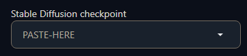

# Extra Network Browser


Inspired by the Extra Network tabs in Automatic1111's WebUI, Extra Network Browser is a stand-alone take on the concept with additional features.

Easily choose a LoRA, HyperNetwork, Embedding, Checkpoint, or Style visually and copy the trigger, keywords, and suggested weight *to the clipboard* for easy pasting into the application of your choice.

Advantages over the Extra Network Tabs:

* Great for UI's like ComfyUI when used with nodes like [Lora Tag Loader](https://github.com/badjeff/comfyui_lora_tag_loader/) or [ComfyUI Prompt Control](https://github.com/asagi4/comfyui-prompt-control).
* Considerably faster, loads thousands of LoRA.
* A [Styles](#styles) tab that parses a styles CSV for thumbnail previews just like networks.
* [Keywords](#keywords) in the filename inside brackets [ ]'s are copied along with the LoRA trigger.
* [Weights](#weights) placed in braces { }'s *(eg {1.0} or {0.7-0.8})* in the filename are automatically set in the LoRA's trigger.
* Some characters not compatible with filenames are automatically converted from placeholders, such as ©️ to : *(for [keywords with weights](#weights))*
* Sort by Name, Date Modified, or try Random sort for inspiration.
* Support for multiple images per LoRA/model/etc in a [modal gallery](#modal). Hover over a card & click the folder icon.
* Support for [displaying a companion .txt file](#modal) to store descriptions, notes, and prompts. Hover over a card & click the document icon.

<br />

## Installation / Setup

1) You must have [Node.JS](https://nodejs.org/en) 20.10.0 LTS or greater installed. *(I recommend the LTS.)*
2) clone (or download and unzip) this repo and cd into the newly created folder.<br />
   ```git clone https://github.com/WebDev9000/extra-network-browser.git && cd extra-network-browser```
4) Run `setup.bat` (once)

5) Run `start.bat`

<details>
<summary>Manual installation and start up</summary>

#### Setup:

```
git clone https://github.com/WebDev9000/extra-network-browser.git && cd extra-network-browser
cd api && npm install
cd ../app && npm install
```

#### Start up:

5) From api folder: `start node index` *(This starts the backend that'll deal with the filesystem)*
6) From app folder: `start npm run dev` *(The React frontend)*

*(Note: you can also use `npm run build` followed by `npm run preview`, or serve the dist folder with the webserver of your choice, such as nginx. This will give slightly better performance. If you do so, you must rerun `npm run build` after any new updates or changes to the code.)*

</details>
<br />

Then add content:

- Populate the folders in `api/networks/` with your files: `lora`, `checkpoints`, `embeddings`, `hypernets`, and `styles`.
- Edit `api/networks/styles.csv` with *(only)* `name,prompt` on the first line, and your styles (following the format shown [below](#styles)) on the subsequent lines.

***OR***

1) `cd api/networks` and remove any folders you wish to symlink, and/or styles.csv if you wish to symlink it.
2) symlink your WebUI or other existing model folders to the following names: `lora`, `checkpoints`, `embeddings`, `hypernets`, `styles`
3) symlink your WebUI styles.csv to the root of the networks folder.

<details>
<summary>How to make symbolic links</summary>

Symlinking your existing folders is suggested and can be done as such:

``` bash
# Windows
mklink /d lora C:\webui\models\LoRA
# ... (other folders) ...
mklink styles.csv C:\webui\styles.csv

# Linux:
ln -s ~/webui/models/LoRA lora
# ... (other folders) ...
ln -s ~/webui/styles.csv styles.csv
```
</details>
<br />

<br />

## How to Use:


Filenames following the suggested naming convention are ***optional***, but to get the full convivence of the Extra Network Browser, the following format is suggested:

``` ini
name_v1_author [keyword1, keyword2] [keyword3, keyword4] (suggested model) {weight1-weight2} #tag1 #tag2.safetensors
```

With matching files of the same name ending in **.jpeg** in the same folder, max height 336px.  *(Width is auto-cropped to center at 224px)*
<a id="modal"></a>
Saving additional images as `filename. (1).jpeg`, `filename. (2).jpeg` and so on will populate a modal gallery popup.  You can then navigate to the prev / next network card with the left / right arrow keys while the modal is open.

To quickly rename a batch of images in this pattern in Windows, select multiple images, then rename them as `filename..jpeg` (two dots) -- windows will automatically add ` (1)`, ` (2)` and so on.

Finally, add a `filename.txt` file in the same folder for a quick info modal.  Great for storing descriptions, notes, and sample prompts.  You can switch between the modal gallery and the modal notes with the up / down arrow keys while the modal is open.

<br />

#### Why only .JPEG?

Currently this is to keep the file scanning time fast, and the image loading and memory requirements low.  Using a single format means the application doesn't need to check for multiple possible formats per LoRA/checkpoint/etc, or load much larger PNG files.

*Want to use .jpg, .png, or something else?  Simply modify `api/index.js` and change `const imgExt = 'jpeg'`, line 7.*

<br />

Formats such as .PNG can be mass converted while leaving the originals intact using [ImageMagick](https://imagemagick.org) like so:

```
magick mogrify -format jpeg *.png
```

<br />

## Examples:


---

<a id="keywords"></a>
### the LoRA / image pair:

`api/networks/lora/example-lora_v1_johndoe [mylora] [anotherkeyword] (RevAnimated) {0.7-0.8} #style.safetensors`<br />
`api/networks/lora/example-lora_v1_johndoe [mylora] [anotherkeyword] (RevAnimated) {0.7-0.8} #style.jpeg`

will copy to the clipboard:

`mylora, anotherkeyword <lora:my-lora_v1_johndoe [mylora, anotherkeyword] (RevAnimated) {0.7-0.8} #style:0.8>`

with the needed ***keywords and suggested weight ready to go!***

This is based on my personal naming preferences and has worked well for managing a large collection.<br />
If you choose to follow a different naming convention without keywords or weights, the program will still simply copy ```<lora:LoraName:1.0>``` to the clipboard.

---

<a id="weights"></a>
### Another example, Keywords with Weights:

`api/networks/lora/example-lora_v1_johndoe [anotherlora, watercolor (medium), (awesome©️1.4}] [anotherkeyword] (RevAnimated) {1.0} #style.safetensors`

`api/networks/lora/example-lora_v1_johndoe [anotherlora, watercolor (medium), (awesome©️1.4}] [anotherkeyword] (RevAnimated) {1.0} #style.jpeg`

Will copy to the clipboard:

`anotherlora, watercolor \(medium\), (awesome:1.4), anotherkeyword <lora:nother-lora_v1_johndoe [anotherlora, (awesome:1.4}] [anotherkeyword] (RevAnimated) {1.0} #style:1.0>`

Note the ( )'s are escaped as needed on non-weights, and ©️ is replaced by : (because : can't be in a filename).  I've found this very useful when dealing with keywords that have suggested weights.

Without a weight or range, it will default to :1.0.

**ComfyUI Users:** Please note that as of this writing, when loading a LoRA via prompt using the [ComfyUI Prompt Control](https://github.com/asagi4/comfyui-prompt-control) nodes, braces { } in the filename are incompatible even when escaped.  To address this I've made a small custom input node that disables "Dynamic Prompts", which you can find [here](https://github.com/WebDev9000/WebDev9000-Nodes).

<br />

## Misc

### Other Networks:

Hypernetworks will copy the keywords, name, and weight using the formats above:

`keywords <hypernet:NAME:WEIGHT>`

while **Checkpoints** and **Embeddings** will copy the name to the clipboard for easy pasting and/or filtering within the UI of your choice.

#### Where to paste checkpoint names in WebUI and ComfyUI:

 &nbsp;


then press enter.

---

<a id="styles"></a>
### Styles:

Some LoRA have multiple possible characters, outfits, or activations attached.  Managing all of this in the filename is impractical, and sometimes impossible due to filename length limits.

For that reason I recommend storing activations for LoRA with many keywords in your Styles.csv, either the one created by Auto's WebUI or manually created.

Each entry (name, prompt) in the file then becomes a card, just like LoRA, checkpoints, etc. for easy use.  Simply add a .JPEG file matching each name field to the `api/networks/styles` folder for the preview, and the prompt field will be copied to the clipboard on click.

**The suggested format for styles.csv is:**

```
name,prompt
Name (Author) - Description, "keywords"
```

For example:

```
name,prompt
My-LoRA (John Doe) - Style 1, "keyword1, additional keywords, etc"
My-LoRA (John Doe) - Style 2, "keyword2, additional keywords, etc"
```

**The file must be in the UTF-8 encoding**, not UTF-8 BOM.<br />
Double check your file if it was created by the WebUI.  It should still work fine with the WebUI as UTF-8.

In this example, your matching image files in `api/networks/styles` would be:

`api/networks/styles/My-LoRA (John Doe) - Style 1.jpeg`<br/>
`api/networks/styles/My-LoRA (John Doe) - Style 2.jpeg`

<br />

## Contributing

This repo is a personal project that I am sharing in the hope that others may also find value.<br />
Github does not allow disabling Pull Requests, however please be aware **I am not currently accepting PRs**.
